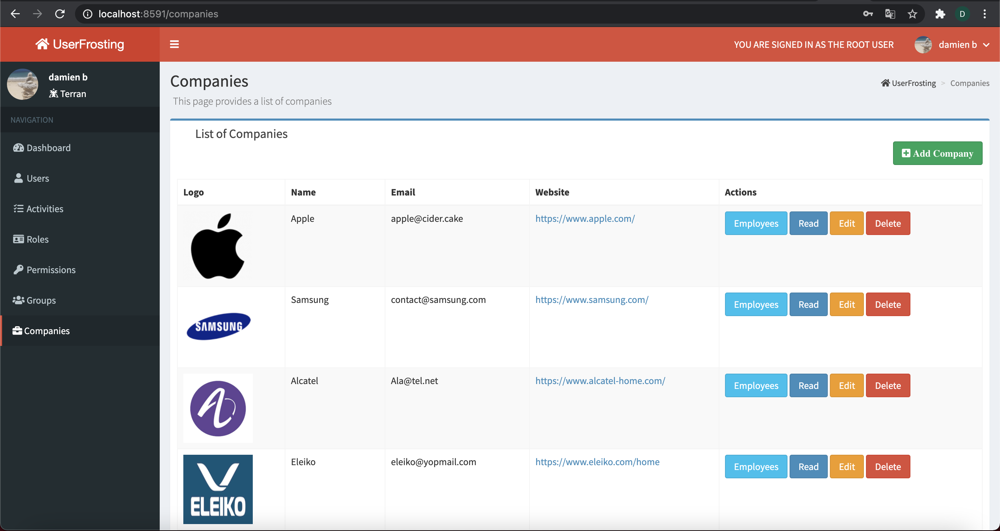
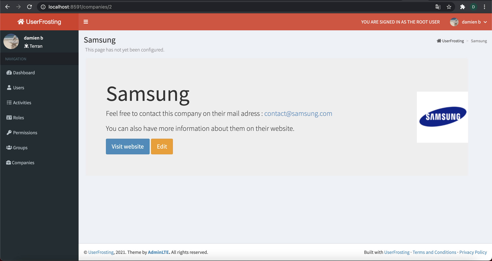
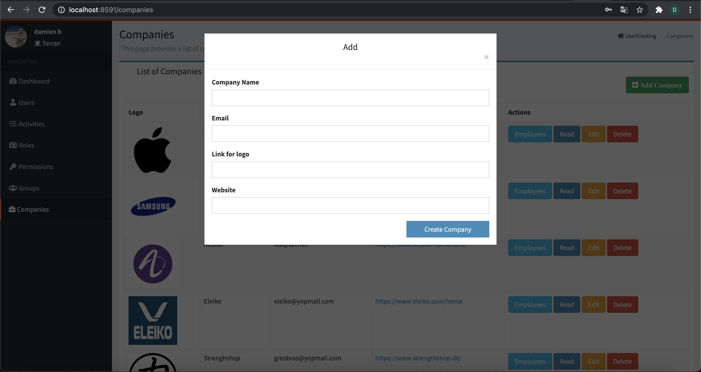
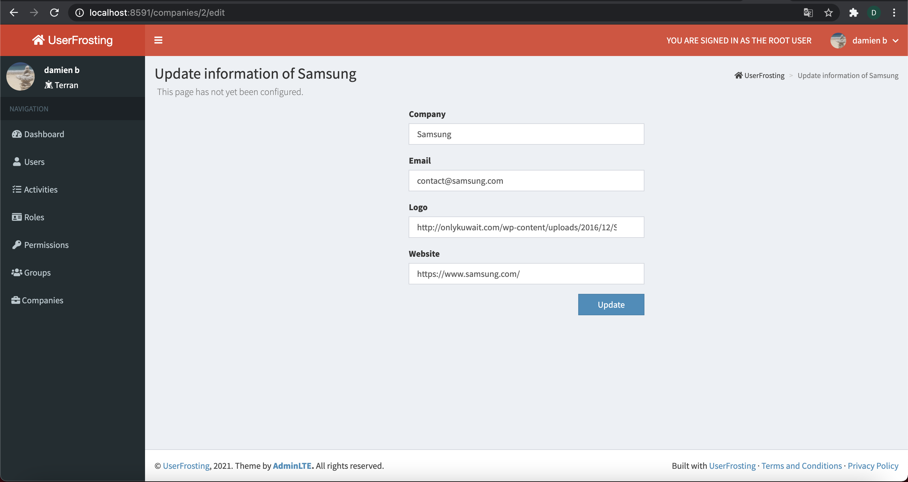
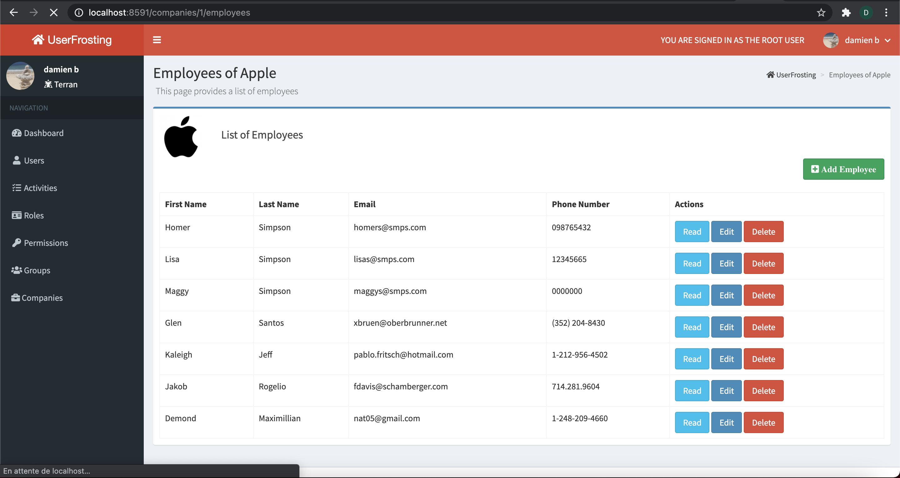
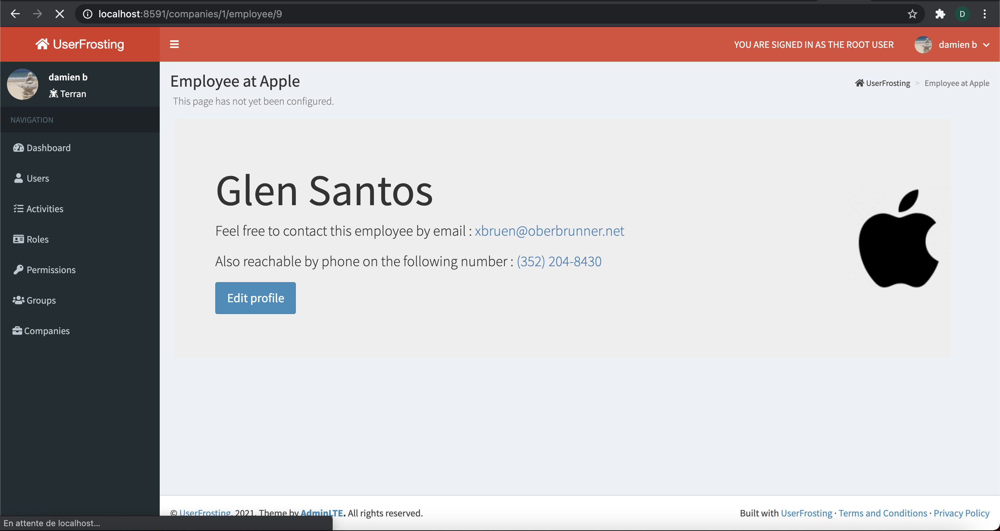
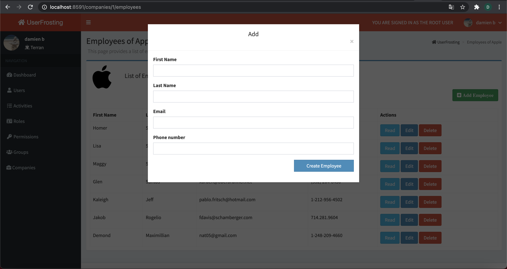
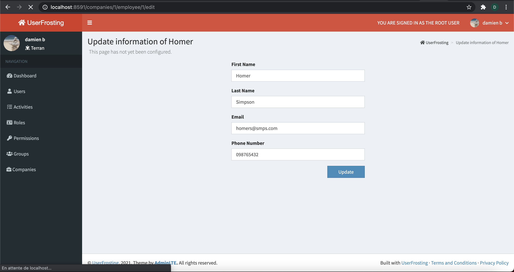

# Exercise with UserFrosting 

### Two Tables
 Companies -> | Company name | email | logo | website | 

Employees -> | First name | Last name | Email | Phone number | 


### CRUD for both 
### Prevent users to register

## Few screenshots

### List of companies


### Company page 


### Add/Create company


### Edit company


### List of employees


### Employee page 


### Add/Create employee


### Edit employee


## Installation

Clone the repositery 

In terminal enter the following command lines:
```
  docker-compose build --no-cache
  docker-compose up -d
  docker-compose exec app sh -c "composer update"
  docker-compose exec app sh -c "php bakery bake"
```
run migrations and seed:
```
  php bakery migrate
  php bakery seed DefaultCompanies DefaultEmployees
```
Account to connect : 
* email : dnr94110@gmail.com  
* password : azertyui
